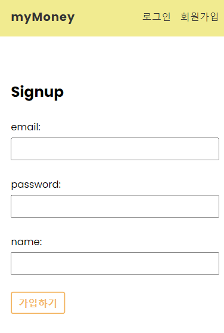
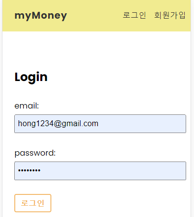
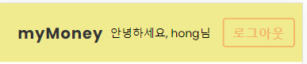
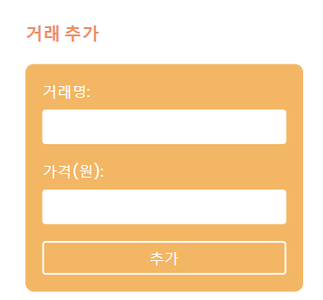
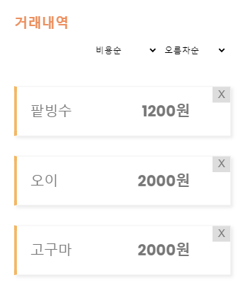
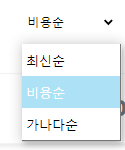
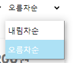

# React + Vite

## FireBase(DB)를 활용한 MyMoney 관리 APP

- 소비 기록을 작성하고 관리하는 앱
- 회원만 사용 가능 (회원가입 및 로그인 필요)

### 회원가입 화면

- email 형식에 맞게 작성하지 않으면 오류 발생하며
- password는 firebase의 자체적인 유효성 검사로 인하여 6자 이상 작성해야한다.
  

### 로그인 화면

## 로그아웃 기능

- 네브바의 로그아웃 버튼을 클릭하면 로그아웃 처리된다.

### 거래 추가 기능

- 소비한 내용과 가격 기재하여 DB에 저장가능
  

### 거래내역

- 거래가 추가 될 때마다 자동으로 거래내역에 업데이트 된다.
  

#### 정렬 기능

- 
- 원하는 정렬 기준으로 거래내역을 확인 할 수 있다.

1.  정렬 기준 (최신순, 비용순, 가나다순)

- 

2.  정렬 기준 (오름차순, 내림차순)

- 

### 배포주소

- https://react-my-money-app-joeuni.netlify.app/
